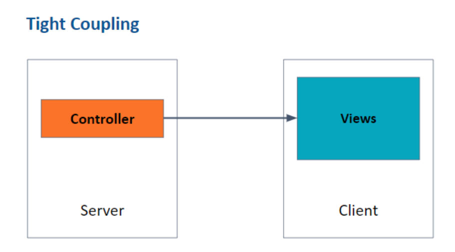
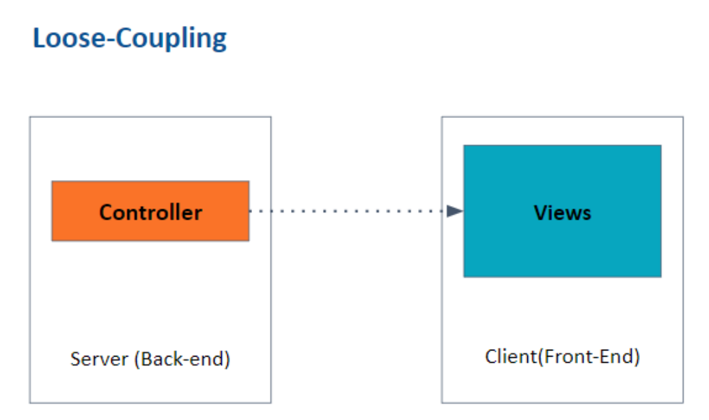
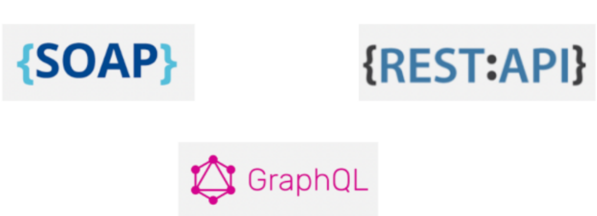
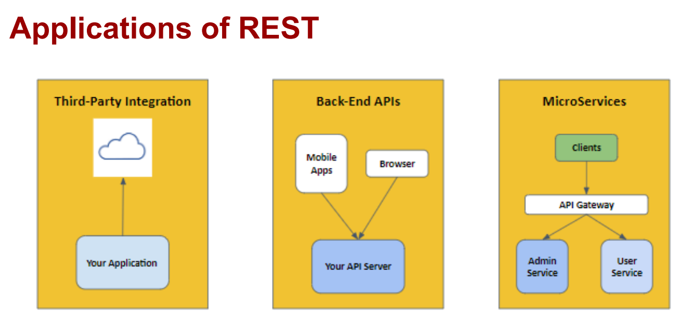

## REST API

## Understanding API
### Problems with MVC
1. Complexity: MVC can become complex as the application grows, making it
difficult to maintain and understand the code.
2. Tight coupling: Components in MVC can be tightly coupled, making it
challenging to modify one component without affecting others.
3. Difficulty in making changes: Due to the complex and tightly coupled nature
of MVC, making changes to the application can be difficult.
4. Difficulty in scaling: As the application grows, scaling an MVC architecture
can pose challenges.

### API (Application Programming Interface)
APIs are different from MVC in terms of how they handle data. In MVC, the server
typically renders views and sends them to the client, which includes both the
structure and data to be displayed. On the other hand, APIs primarily focus on
sending data instead of views.
- APIs provide a solution to the problems of tightly-coupled systems in MVC
applications.
- APIs separate the frontend and backend components, allowing them to
communicate through a well-defined interface.
- APIs enable easier modification of individual components without impacting
the entire system.
- APIs promote code reusability and facilitate the use of existing services and
data from other applications

### Types of APIs
SOAP (Simple Object Access Protocol): A protocol for exchanging structured
information in web services. It uses XML and relies on transport protocols like
HTTP or SMTP.
- REST (Representational State Transfer): An architectural style for designing
networked applications. It uses HTTP methods (GET, POST, PUT, DELETE)
to perform operations on resources identified by URIs. RESTful APIs are easy
to build, maintain, and scale.
- GraphQL: A query language and runtime for APIs. It allows clients to request
only the data they need, making it more efficient than traditional REST APIs.
GraphQL can also aggregate data from multiple source

## Understanding REST
### RESTful API
- Representational State Transfer is an architectural style for designing
networked applications that use standard HTTP protocols to communicate
between the client and server. REST APIs are built on top of the HTTP
protocol and work with resources identified by URLs.
- Stateless architecture is a key principle of REST, meaning the server doesn't
store client-specific states between requests. Each request must contain all
the necessary information for the server to process it. The advantages of a
stateless architecture include improved scalability, easier maintenance, and
better fault tolerance.
- It is an Architectural Guideline
- It is popularly used across different types of systems.
### Benefits REST API
The benefits of using REST APIs include simplicity, scalability, cacheability,
interoperability, flexibility, and security

### REST Methods
REST APIs use standard HTTP methods like GET, POST, PUT, and DELETE to
perform operations on resources.
1. GET requests to retrieve information about a resource or a collection of
resources.
2. POST requests create a new resource.
3. PUT requests to update an existing resource.
4. DELETE requests remove a resource.

### Applications of REST
REST APIs play a crucial role in modern web applications, allowing them to
efficiently communicate and exchange data with various systems. Some common
applications of REST APIs include:

1. **Integrating with third-party services:** REST APIs can be used to interact
with external services like social media platforms, payment gateways, or
analytics tools, adding more functionality to your web application.
2. **Creating a consistent backend for multiple platforms:** REST APIs can
serve as a common backend for web, mobile, and desktop applications,
ensuring that all platforms access the same data and logic.
3. **Developing microservices:** REST APIs can be used to break down a
monolithic application into smaller, more manageable microservices,
improving scalability and maintainability.

