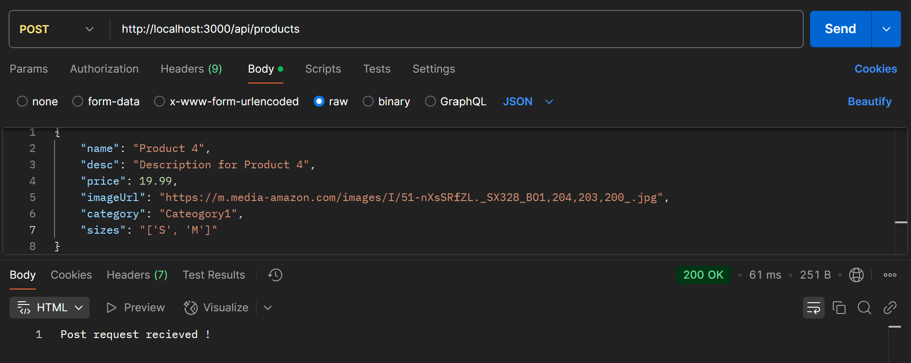
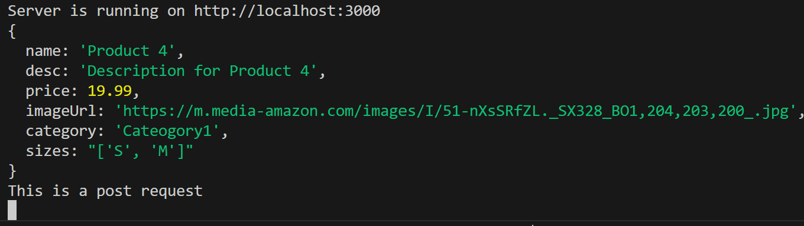
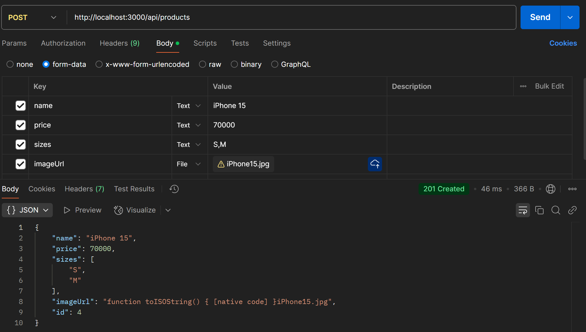

## REST API

## Understanding API

### Problems with MVC

1. Complexity: MVC can become complex as the application grows, making it
   difficult to maintain and understand the code.
2. Tight coupling: Components in MVC can be tightly coupled, making it
   challenging to modify one component without affecting others.
3. Difficulty in making changes: Due to the complex and tightly coupled nature
   of MVC, making changes to the application can be difficult.
4. Difficulty in scaling: As the application grows, scaling an MVC architecture
   can pose challenges.
   

### API (Application Programming Interface)

APIs are different from MVC in terms of how they handle data. In MVC, the server
typically renders views and sends them to the client, which includes both the
structure and data to be displayed. On the other hand, APIs primarily focus on
sending data instead of views.

- APIs provide a solution to the problems of tightly-coupled systems in MVC
  applications.
- APIs separate the frontend and backend components, allowing them to
  communicate through a well-defined interface.
- APIs enable easier modification of individual components without impacting
  the entire system.
- APIs promote code reusability and facilitate the use of existing services and
  data from other applications
  

### Types of APIs

SOAP (Simple Object Access Protocol): A protocol for exchanging structured
information in web services. It uses XML and relies on transport protocols like
HTTP or SMTP.

- REST (Representational State Transfer): An architectural style for designing
  networked applications. It uses HTTP methods (GET, POST, PUT, DELETE)
  to perform operations on resources identified by URIs. RESTful APIs are easy
  to build, maintain, and scale.
- GraphQL: A query language and runtime for APIs. It allows clients to request
  only the data they need, making it more efficient than traditional REST APIs.
  GraphQL can also aggregate data from multiple source
  

## Understanding REST

### RESTful API

- Representational State Transfer is an architectural style for designing
  networked applications that use standard HTTP protocols to communicate
  between the client and server. REST APIs are built on top of the HTTP
  protocol and work with resources identified by URLs.
- Stateless architecture is a key principle of REST, meaning the server doesn't
  store client-specific states between requests. Each request must contain all
  the necessary information for the server to process it. The advantages of a
  stateless architecture include improved scalability, easier maintenance, and
  better fault tolerance.
- It is an Architectural Guideline
- It is popularly used across different types of systems.

### Benefits REST API

The benefits of using REST APIs include simplicity, scalability, cacheability,
interoperability, flexibility, and security

### REST Methods

REST APIs use standard HTTP methods like GET, POST, PUT, and DELETE to
perform operations on resources.

1. GET requests to retrieve information about a resource or a collection of
   resources.
2. POST requests create a new resource.
3. PUT requests to update an existing resource.
4. DELETE requests remove a resource.

### Applications of REST

REST APIs play a crucial role in modern web applications, allowing them to
efficiently communicate and exchange data with various systems. Some common
applications of REST APIs include:

1. **Integrating with third-party services:** REST APIs can be used to interact
   with external services like social media platforms, payment gateways, or
   analytics tools, adding more functionality to your web application.
2. **Creating a consistent backend for multiple platforms:** REST APIs can
   serve as a common backend for web, mobile, and desktop applications,
   ensuring that all platforms access the same data and logic.
3. **Developing microservices:** REST APIs can be used to break down a
   monolithic application into smaller, more manageable microservices,
   improving scalability and maintainability.


## Getting Started with API Project


## Project Set-Up

### 1. Initialize Node.js Project

```bash
npm init
```

This creates `package.json` for managing dependencies.

### 2. Install Express.js

Express.js is required to set up a web server. Install it using:

```bash
npm install express.
```

### 3. Steps to create the folder structure

1. Create a new folder named "E-Commerce API" for the project.
2. Inside the "E-COMMERCE API" folder, add a file named "server.js" to serve as the
   main server file for the project.

```javascript
// 1. Import Server
import express from "express";

// 2. Create Server
const server = express();

// 3. Default Request Handler
server.get("/", (req, res) => {
  res.send("Welcome to E-commerce API");
});

// 4. Speicify port
const PORT = 3000;
server.listen(PORT, () => {
  console.log(`Server is running on http://localhost:${PORT}`);
});
```

3. Create a new folder named "src" inside the "E-COMMERCE API" folder to store the
   source code of the application.
4. Inside the "src" folder, create a folder named “features”
5. Inside the "features" folder, create separate folders for different modules of
   the application such as "cart", "order", "product", and "user". These folders
   will contain the respective module-related files.
6. Additionally, create a folder named "middlewares" inside the "src" folder to
   store middleware files that will be used in the application.


### 4. Configure .gitignore

Create a `.gitignore file` and add `node_modules/` to exclude unnecessary files from Git tracking, keeping your repository clean.

### 5. Run Server

#### Way-1: Run the server manually:

```bash
node index.js
```

#### Way-2: Automatically restart server on changes:

Install nodemon globally:

```bash
npm install -g nodemon
```

- Installs nodemon system-wide.
- Not tied to any specific project.
- Doesn't appear in package.json.
- You can run nodemon from anywhere in the terminal.

OR

Install nodemon locally (--save-dev flag):

```bash
npm i -D nodemon (or npm install --save-dev nodemon)
```

- Installs nodemon only for the current project.
- Gets added under devDependencies in package.json; as only needed during development, not in production.
- To run it, you must use npx nodemon or configure it in package.json.

Update package.json → Add this inside the "scripts" section:

```json
"scripts": {
  "start": "nodemon index.js"
}
```

Run the server with:

```bash
npm start
```

## Setting Up Routes For Product

1. The goal is to create APIs related to products in the E-COMMERCE API project.
2. The APIs to be created for the product module are:
   - Get all products
   - Add a product
   - Get one product
   - Rate a product
   - Filter Product
3. These APIs will be handled in the product controller.
4. A separate folder for controllers can be created within the product module to
   manage multiple controllers.
5. The product controller file is created as "product.controller.js" in the product
   folder.
6. The product routes file is created as "product.routes.js" in the product folder.
7. Express router module is used to handle paths from the server to controller
   methods.
8. The product roots file manages the paths to the product controller.
9. The path "/api/products" is used as a good practice for API paths.
10. The server file redirects requests related to products to the product roots file.
11. The product roots file specifies the paths and calls the respective controller
    methods.
12. Other routes for different modules like user and order can be implemented
    similarly.
13. Separate route files are recommended for each feature to maintain a modular
    structure.

### Code for product.controller.js file:

```javascript
export default class ProductController {
  getAllProducts(req, res) {
    // Code for getting all products
  }

  addProduct(req, res) {
    // Code for adding a product
  }

  rateProduct(req, res) {
    // Code for rating a product
  }

  getOneProduct(req, res) {
    // Code for getting one product
  }
}
```

### Code for product.routes.js:

```javascript
import express from "express";
import ProductController from "./product.controller.js";

const productRouter = express.Router();
const productController = new ProductController();

productRouter.get("/", productController.getAllProducts);
productRouter.post("/", productController.addProduct);
productRouter.get("/:id", productController.getOneProduct);
productRouter.post("/rate", productController.rateProduct);

export default productRouter;
```

### Code for server.js

```javascript
// Import Server
import express from "express";
import productRouter from "./src/features/product/product.routes.js";

// Create Server
const server = express();

//For all request related to products, redirect to product routes.
//localhost:3000/api/products
server.use("/api/products", productRouter);

// Default Request Handler
server.get("/", (req, res) => {
  res.send("Welcome to E-commerce API");
});

// Speicify port
const PORT = 3000;
server.listen(PORT, () => {
  console.log(`Server is running on http://localhost:${PORT}`);
});
```

## Product Model

1. Create the product model class in "product.model.js":

```javascript
export default class ProductModel {
  constructor(id, name, desc, price, imageUrl, category, sizes) {
    this.ide = id;
    this.name = name;
    this.desc = desc;
    this.price = price;
    this.imageUrl = imageUrl;
    this.category = category;
    this.sizes = sizes;
  }

  static GetAll() {
    return products;
  }
}

var products = [
  new ProductModel(
    1,
    "Product 1",
    "Description for Product 1",
    19.99,
    "https://m.media-amazon.com/images/I/51-nXsSRfZL._SX328_BO1,204,203,200_.jpg",
    "Cateogory1"
  ),
  new ProductModel(
    2,
    "Product 2",
    "Description for Product 2",
    29.99,
    "https://m.media-amazon.com/images/I/51xwGSNX-EL._SX356_BO1,204,203,200_.jpg",
    "Cateogory2",
    ["M", "XL"]
  ),
  new ProductModel(
    3,
    "Product 3",
    "Description for Product 3",
    39.99,
    "https://m.media-amazon.com/images/I/31PBdo581fL._SX317_BO1,204,203,200_.jpg",
    "Cateogory3",
    ["M", "XL", "S"]
  ),
];
```

Explanation:

- The product model is created as a class with properties such as ID,
  name, description, imageUrl, category, price, and sizes.
- The constructor initializes these properties when a new product object
  is created.
- The static method getAll() returns an array of product objects. These
  objects represent the default products in the system.

2. Implementing the API in the product controller:

```javascript
import ProductModel from "./product.model.js";

export default class ProductController {
  getAllProducts(req, res) {
    // Code for getting all products
    const products = ProductModel.GetAll();
    res.status(200).send(products);
  }
```

Explanation:

- The product controller imports the ProductModel class from the
  product.model.js file.
- The getAllProducts function is a request handler for the route that
  retrieves all products.
- Inside the function, it calls the static getAll() method of the
  ProductModel to retrieve the products.
- The retrieved products are sent as the response using res.send().
- The status code 200 (OK) is set to indicate a successful response.

3. Setting up the route in the product router:

```javascript
import express from "express";
import ProductController from "./product.controller.js";

const productRouter = express.Router();
const productController = new ProductController();

productRouter.get("/", productController.getAllProducts);
productRouter.post("/", productController.addProduct);
productRouter.get("/:id", (req, res) => {
  // Logic to fetch a single product by its ID
});
productRouter.post("/", (req, res) => {
  // Logic to create a new product
});

export default productRouter;
```

Explanation:

- The product router is created using express.Router().
- The router is configured to handle a GET request at the root path ("/")
  and call the getAllProducts function from the product controller.
- The router is exported to be used in the server file.

4. Importing and using the product router in the server:

```javascript
// 1. Import Server
import express from "express";
import productRouter from "./src/features/product/product.routes.js";

// 2. Create Server
const server = express();

// For all requests related to product, redirect to product routes
// localhost:3000/api/products
server.use("/api/products", productRouter);

// 3. Default Request Handler
server.get("/", (req, res) => {
  res.send("Welcome to E-commerce API");
});

// 4. Speicify port
const PORT = 3000;
server.listen(PORT, () => {
  console.log(`Server is running on http://localhost:${PORT}`);
});
```

Explanation:

- The product router is imported from the "product.router.js" file.
- The router is used as middleware with the base path '/api/products'.
- When a request is made to the server with the path '/api/products', it
  will be handled by the product router.
- The server listens on the specified port (3000) and logs a message
  when it is running.

5. Testing the API:
   Make a GET request to http://localhost:3000/api/products in a
   browser or using a tool like Postman. The response will be an array of product
   objects as specified in the getAll() function of the product model.

## Understanding POST-Request

### 1. POST Requests in product.controller.js

When a client (like Postman) sends a POST request to your API, the server needs to extract data from the request body. The addProduct method in product.controller.js is responsible for handling such requests.

```javascript
addProduct(req, res) {
    // Code for adding a product
    console.log(req.body);
    console.log("This is a post request");
    res.status(200).send("Post request recieved !");
}
```

### 2. Installing body-parser

Before the server can access `req.body`, it needs to parse incoming JSON data. This is where body-parser comes into play. Without body-parser, req.body would be `undefined`, as Express doesn't process request bodies by default.

```sh
npm i body-parser
```

### 3. Configuring body-parser in server.js

Once installed, you need to use body-parser middleware in server.js:

```javascript
import express from "express";
import bodyParser from "body-parser"; //Import body-parser

const server = express();
server.use(bodyParser.json()); // Enables JSON parsing for incoming requests
```

#### Why Use body-parser?

When a client sends data in JSON format (e.g., from Postman or a frontend app), body-parser.json() ensures that this data is converted into a JavaScript object, making it accessible via req.body.

In Postman:



In VS Code terminal:



## Add Product API

### 1. Code for fileupload.middleware.js:
Purpose: Configures multer to handle file uploads.
#### Key Features:
  - Stores uploaded files in the ./uploads/ directory.
  - Renames files by appending a timestamp to avoid conflicts.
  - upload middleware is exported for use in routes.
```javascript
// 1. Import Multer
import multer from "multer";

// 2. Configure storage with filename and location.
const storage = multer.diskStorage({
  destination: (req, file, cb) => {
    cb(null, "./uploads/");
  },
  filename: (req, file, cb) => {
    cb(null, new Date().toISOString + file.originalname);
  },
});

export const upload = multer({ storage: storage });
```

### 2. Code for product.model.js file:
add(product): Assigns an id to the product and adds it to the products array.

```javascript
export default class ProductModel {
  constructor(id, name, desc, price, imageUrl, category, sizes) {
    this.ide = id;
    this.name = name;
    this.desc = desc;
    this.price = price;
    this.imageUrl = imageUrl;
    this.category = category;
    this.sizes = sizes;
  }

  static GetAll() {
    return products;
  }

  static add(product) {
    product.id = products.length + 1;
    products.push(product);
    return product;
  }
}

var products = [
  new ProductModel(
    1,
    "Product 1",
    "Description for Product 1",
    19.99,
    "https://m.media-amazon.com/images/I/51-nXsSRfZL._SX328_BO1,204,203,200_.jpg",
    "Cateogory1"
  ),
  new ProductModel(
    2,
    "Product 2",
    "Description for Product 2",
    29.99,
    "https://m.media-amazon.com/images/I/51xwGSNX-EL._SX356_BO1,204,203,200_.jpg",
    "Cateogory2",
    ["M", "XL"]
  ),
  new ProductModel(
    3,
    "Product 3",
    "Description for Product 3",
    39.99,
    "https://m.media-amazon.com/images/I/31PBdo581fL._SX317_BO1,204,203,200_.jpg",
    "Cateogory3",
    ["M", "XL", "S"]
  ),
];
```

### 3. Code for product.controller.js:
Implemented addProduct(req, res):
  - Extracts product details (name, price, sizes) from the request body.
  - Converts price to a floating number and sizes to an array.
  - Assigns the uploaded image filename (req.file.filename).
  - Calls ProductModel.add() to save the new product.
  - Returns the newly created product as a response.

```javascript
import ProductModel from "./product.model.js";

export default class ProductController {
  getAllProducts(req, res) {
    const products = ProductModel.GetAll();
    res.status(200).send(products);
  }

  addProduct(req, res) {
    //console.log(req.body);
    //console.log("This is a post request");
    const { name, price, sizes } = req.body;
    const newProduct = {
      name,
      price: parseFloat(price),
      sizes: sizes.split(","),
      imageUrl: req.file.filename,
    };
    const createdRecord = ProductModel.add(newProduct);
    res.status(201).send(createdRecord);
  }
}
```

### 4. Code for product.routes.js file:
productRouter.post("/"):
  - Uses upload.single("imageUrl") to handle single-file image uploads.
  - Calls productController.addProduct to add a product.
```javascript
productRouter.post(
  "/",
  upload.single("imageUrl"),
  productController.addProduct
);
```
### 5. Test API using Postman
