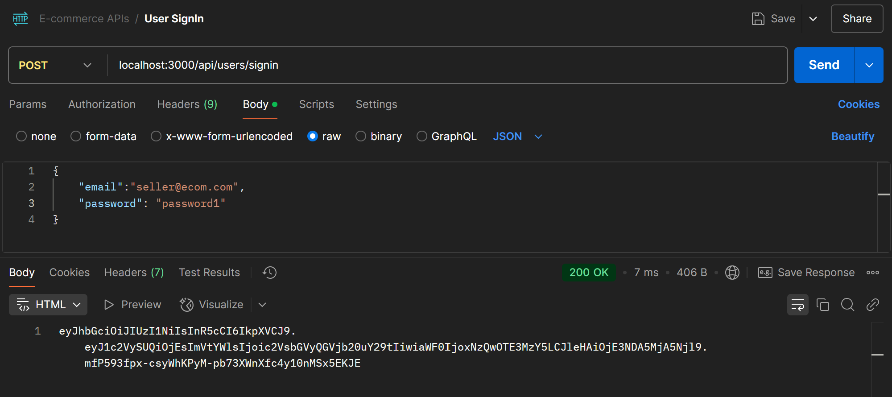

## SECURING APIs

## Understanding Security

### Introduction to the next set of APIs

#### APIs to be created:

- Rate a product.
- Add products to a cart.
- Retrieve products from the cart.
- Remove a product from the cart.

### Need for User Authentication

- User authentication is required for user-specific actions.
- Actions such as adding items to the cart or placing orders require user
  identification.
- Without authentication, it becomes difficult for the system to determine
  user-specific actions.

### Reasons for Securing the Application

- Controlled access: Only logged-in users should access certain features.
- Data privacy: User data should not be accessible to everyone.
- Examples: Misuse of private data on social media platforms.

### How to Secure the Application

- Authentication and authorization are essential.
- Authentication verifies the identity of a user.
- Authorization determines what a user can access based on their privileges.

### Authentication and Authorization


### Types of Authentication


1. **Basic authentication:** Users provide credentials with each request.
2. **API keys:** Unique keys for user identification (used by third-party APIs).
3. **OAuth (Open Authentication):** Allows authentication using third-party
   applications (e.g., Google or Facebook).
4. **JWT (JSON Web Token):** Popular authentication method using tokens (more
   details in future videos).

## User APIs
### Securing REST API Application
- The first step towards securing the application is by creating two APIs for user
registration and login.
- Add two APIs to the user controller: one for sign up and another for sign in.
- The sign-up API will accept user details such as email, name, password, and
user type (customer or seller).
- The sign-in API will require the user to provide their email and password.
- Create a new folder named "user" inside the existing "features" directory.
- Within the "user" folder, three files are created: user.model.js,
user.controller.js, and user.routes.js.


### 1.  user.model.js file
- The user.model.js file defines a User class with a constructor that takes
parameters for name, email, password, and user type.
- A default user is created with the name "Seller User," email
"seller@ecom.com," password "password1," and user type "seller."
```javascript
export class UserModel {
  constructor(id, name, email, password, type) {
    this.id = id;
    this.name = name;
    this.email = email;
    this.password = password;
    this.type = type;
  }

  static signUp(name, email, password, type) {
    const newUser = new UserModel(
      users.length + 1,
      name,
      email,
      password,
      type
    );
    users.push(newUser);
    return newUser;
  }

  static signIn(email, password) {
    const user = users.find((u) => u.email == email && u.password == password);
    return user;
  }
}

var users = [
  {
    id: 1,
    name: "Seller User",
    email: "seller@ecom.com",
    password: "password1",
    type: "seller",
  },
];
```

### 2. user.controller.js file
The user.controller.js file is created with a controller class that includes two
functions: signUp and signIn, which both take request and response
parameters.
```javascript
import { UserModel } from "./user.model.js";
export default class UserController {
  signUp(req, res) {
    const { name, email, password, type } = req.body;
    const user = UserModel.signUp(name, email, password, type);
    res.status(201).send(user);
  }

  signIn(req, res) {
    const result = UserModel.signIn(req.body.email, req.body.password);
    if (!result) {
      return res.status(400).send("Invalid Credentials !");
    } else {
      return res.send("Login Successful !");
    }
  }
}
```

### 3. user.routes.js file
- In the user.routes.js file, create routes for user sign-up and sign-in.
- The routes for sign-up and sign-in are both POST requests.
```javascript
// Import necessary modules  
import express from "express";  
import UserController from "./user.controller.js";  

// Initialize router and user controller  
const userRouter = express.Router();  
const userController = new UserController();  

// Define authentication routes  
userRouter.post("/signup", userController.signUp); // User registration  
userRouter.post("/signin", userController.signIn); // User login  

export default userRouter;  

```

## Testing User APIs
We have to test the user sign-up and user sign-in APIs before proceeding to secure
other routes. Open Postman to perform the testing both sign-up and sign-in requests.

### SignUp API
- The URL for the sign-up request is specified as
"localhost:3000/api/users/signup"
- Set up the request body in Postman for the sign-up API. It should contain the
user's name, email, password, and type.
- Send the sign-up request. The response indicates that a new user has been
created with an ID of 2.


### SignIn API
- Test the sign-in API. The request body for sign-in only requires the user's
email and password.
- Provide a valid email and password, and send the request. The response
confirms a successful login with the message "Login successful"
  


- If incorrect credentials are provided, the response will indicate a bad request
with the message "Invalid credentials."


## Basic Authentication Way-1

### 1. Model (user.model.js):
Added static method of UserModel that returns all users (UserModel.getAll()).
```javascript
export class UserModel {
  // Other methods like signUp, signIn.
  
  static getAll() { return users; }
}

```

### 2. Middleware Logic (basicAuthorizer):

1. **Check Authorization Header:** Verify if the Authorization header exists.
2. **Extract Base64 Credentials:** Remove the "Basic " prefix.
3. **Decode Credentials:** Convert from Base64 to "username:password" format.
4. **Validate Format:** Ensure proper splitting into username and password.
5. **Authenticate User:** Match credentials against the user data (UserModel.getAll()).
6. **Grant or Deny Access:** If credentials match, call next(); otherwise, send a 401 Unauthorized response.

```javascript
import { UserModel } from "../features/user/user.model.js";

const basicAuthorizer = (req, res, next) => {
  // 1. Check if the Authorization header is present in the request
  const authHeader = req.headers["authorization"];
  if (!authHeader) {
    return res.status(401).send("No authorization details found!");
  }
  console.log("Authorization Header:", authHeader);

  // 2. Extract the Base64-encoded credentials from the Authorization header
  // The header format is "Basic <base64encodedCredentials>"
  const base64Credentials = authHeader.replace("Basic ", "");
  console.log("Base64 Credentials:", base64Credentials);

  // 3. Decode the Base64-encoded credentials to get the "username:password" format
  const decodeCreds = Buffer.from(base64Credentials, "base64").toString("utf8");
  console.log("Decoded Credentials:", decodeCreds); // Expected format: "username:password"

  // 4. Split the decoded string into username and password
  const creds = decodeCreds.split(":");
  if (creds.length < 2) {
    return res.status(401).send("Invalid authorization format");
  }

  // 5. Validate credentials against the user database
  const user = UserModel.getAll().find(
    (u) => u.email === creds[0] && u.password === creds[1]
  );

  // 6. If a valid user is found, proceed to the next middleware
  if (user) {
    console.log("Authorization successful for user:", creds[0]);
    next();
  } else {
    // 7. If credentials are invalid, return a 401 Unauthorized response
    return res.status(401).send("Incorrect Credentials");
  }
};

export default basicAuthorizer;
```
### 2. Applying Middleware in server.js
1. Import `basicAuthorizer` middleware.
2. Apply basicAuthorizer middleware to protected routes (/api/products).
3. Leave authentication open for /api/users routes (e.g., for signup/login).
```javascript
import basicAuthorizer from "./src/middlewares/basicAuth.middleware.js";

server.use("/api/products", basicAuthorizer, productRouter); 
```
#### NOTE:
- Protected Route: Only authorized users can access /api/products.
- Open Route: All users can access /api/users (for signup/login).
- Authorization Logic: Only proceeds if credentials are correct.

### Testing Basic Authentication
1. Start the server using the command "node server.js" or "npm start" if using nodemon.
2. Use Postman for API testing. The "API products" request is selected, which
has been secured by the authorizers.
3. Accessing the API without providing any credentials results in a 401
unauthorized response, indicating the lack of authorization.


4. Basic authentication credentials (username and password) are added to the
Postman request under the Authorization tab.
5. The "Basic Auth" option is selected, and the username and password are
entered.
6. Upon sending the request with the correct credentials, the data (all the
products & products based on the filter) is successfully retrieved.


7. Request with incorrect credentials returns a 401 unauthorized response.


8. Basic authentication requires providing username and password with each
request to the server.
9. The server verifies the provided credentials for every incoming request,
granting access if the credentials are correct and returning an error response
if they are incorrect.


## Basic Authentication Way-2
1. Objective: Implement basic authentication to secure the APIs in the application.
2. Basic authentication mechanism:
    - Credentials (username and password) provided by the client will be checked
on each request.
    - Middleware named "basicAuth" will be used to simplify the authentication
process and ensure data validation against attacks like SQL injections.
    - The "express-basic-auth" package will be installed to set up basic
authentication.
      ```sh
      npm i express-basic-auth
      ```
3. Middleware Implementation:
    - Create a middleware named "basicAuth" in the "middlewares" folder.
    - he middleware will compare the received email and password with the user
data stored in the user model.
    - If the credentials do not match, an error will be returned.
    - If the credentials are correct, the middleware will proceed to the next
middleware.
    - Secure string comparison will be performed using the "safeCompare" function
to protect against timing attacks.

Code Implementation:
  ```javascript
  // Import required modules
  import bAuth from "express-basic-auth"; // Basic Auth middleware
  import { UserModel } from "../features/user/user.model.js"; // User model

  // Custom function for basic authentication
  const basicAuthorizer = (username, password) => {
    const users = UserModel.getAll(); // Get all users
    const user = users.find((u) => bAuth.safeCompare(username, u.email)); // Find user by email
    return user && bAuth.safeCompare(password, user.password); // Validate password
  };

  // Configure and export the middleware
  const authorizer = bAuth({
    authorizer: basicAuthorizer, // Use custom authorizer
    challenge: true, // Enable auth prompt
  });

  export default authorizer;
  ```

  4. Usage:
    - Import the "authorizer" middleware.
    - Apply the "authorizer" middleware to the relevant API routes that require
authentication (e.g., products APIs) to enforce authentication for accessing
those routes.


## Understanding JWT
### Problems with the implementation of basic authentication
1. No Encryption: The first problem is the lack of encryption in basic
authentication. While tools like Postman use basic encoding, it can be easily
decoded, so a strong encryption technique is needed to securely share
credentials across applications.
2. Need Strong Password: The second problem is that weak passwords can be
easily cracked using brute force attacks. Brute force attacks involve trying
different combinations of characters to guess the password, and passwords
like "password1" are particularly vulnerable.
3. Client Needs to Store Credentials: Another problem is that the client
application needs to store the username and password, typically in the
browser. This can be risky if the browser is accessed by multiple people
because anyone can look into the browser's cookies or stored data to find the
credentials.

### JSON Web Token (JWT) for securing the application
JWT is a token-based authentication method that creates a token instead of
requiring credentials on every request. The token is scalable, easy to
implement, and stateless.

#### Structure of JWT: 
The token consists of three parts separated by dots: the
header (algorithm and token type), the payload (user information and
permissions), and the signature (encrypted information).


- Sensitive data should not be stored in the payload but mentions that user
permissions are a suitable example of data to include.
- JWT is recommended because it provides a stateless behavior of
authentication, allowing the server to verify the token without needing to store
client information.
- Visit the [jwt.io](https://jwt.io/) website to explore the details and examples of JWT tokens.

#### Process of using JWT : 
It involves the client logging in with their credentials
through the login API, the server verifying the credentials and generating a
JWT token, and then sending the token back to the client. The client stores
the token, typically in the browser, and includes it in the authorization header
when making requests to secure APIs.


The server verifies the token and provides a response if the verification is
successful. If the token has been modified or expired, an error with the status
code 401 is returned.

## JWT Authentication - 1
### Implementing JWT authentication in our Express REST API
application.
- Install JSON Web Token package, available on npmjs.com, as the tool to
create and manage JWT tokens for Express.
- The first step is to install the JSON WebToken package using the command
  ```sh
  npm install jsonwebtoken
  ```
- Import the 'jsonwebtoken' package as 'jwt' in the code.
- Use jwt.sign method as mentioned as the function to create the token.
- In the sign-in API, after calling the model's signIn method, instead of sending
a "login successful" message, create the token and send it to the client.
- The sign function of JWT is used to sign the token with the provided
algorithm, private key, and payload.

#### Changes in user.controller.js file:
```javascript
import { UserModel } from "./user.model.js";
import jwt from "jsonwebtoken";
export default class UserController {
  signUp(req, res) {
    const { name, email, password, type } = req.body;
    const user = UserModel.signUp(name, email, password, type);
    res.status(201).send(user);
  }

  signIn(req, res) {
    const result = UserModel.signIn(req.body.email, req.body.password);
    if (!result) {
      return res.status(400).send("Invalid Credentials !");
    } else {
      //1. Create token
      const token = jwt.sign(
        { userID: result.id, email: result.email },
        "N6BUpqT7VL8cI7VbzLHaaS9txwGJWZMR",
        {
          expiresIn: "1h",
        }
      );
      //2. Send token.
      return res.status(200).send(token);
    }
  }
}
```
- The payload should not contain sensitive data like passwords but can include
information such as user ID and authorization permissions.
- The user ID is stored in the payload using the value result.id.
- The private key, which is used for signing and verifying the token, should be a
strong and secure key. Online key generators are recommended for
generating such keys.
- Set the "expiresIn" option to one hour, indicating that the token will be invalid
after that time.
- After creating the token, return it to the client with a status code of 200 (OK).
- The modified login API now generates a token and sends it back to the client.
- The token serves as the client's validation key and can be used to access
secure routes.



